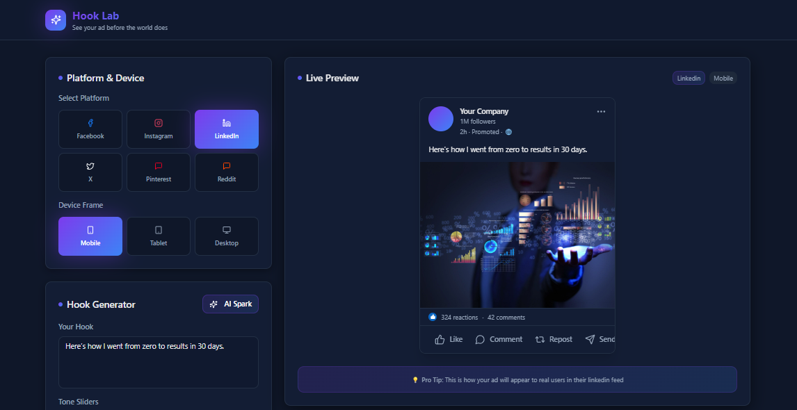

# 🧪 Hook Lab

### See your ad before the world does.

**Hook Lab** is a creative playground for media buyers and marketers to **visualize ad campaigns** across platforms and devices — before they ever launch.

---

### 💡 What It Does
Hook Lab lets you preview and refine ad hooks, headlines, and creatives inside **realistic mock social feeds**.  
Upload an image, type your copy, pick your platform, and instantly see how your ad looks on **Facebook, Instagram, LinkedIn, X, Pinterest, Reddit, or Email(coming soon)**.

---

### ⚡ Highlights
- Cross-platform ad previews  
- Mobile, tablet, and desktop frames  
- Real-time headline + creative editing  
- Side-by-side comparison view  

---

### 🧠 Why It Matters
Stop guessing how your ad *might* look.  
Hook Lab gives you the **clarity and control** to test and present campaigns that actually feel live — helping you make smarter, more confident creative decisions.

---

### 🚀 Tech
Built with **React**, **TailwindCSS**, and **TypeScript**.

---

✨ *Built with creativity and curiosity — by Martin M. Jack*.
